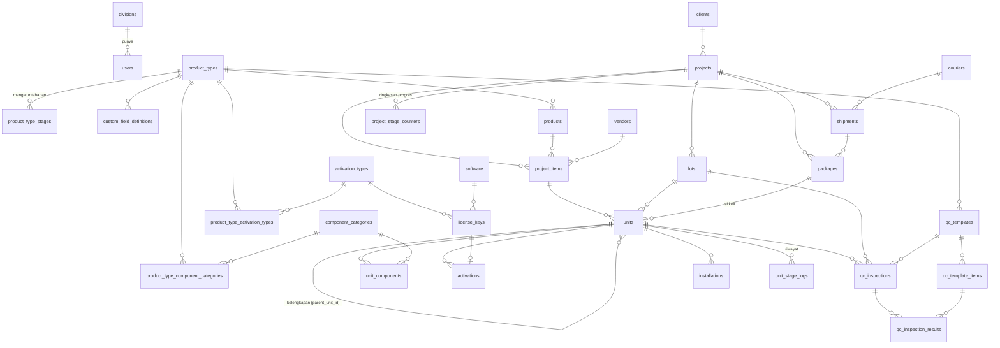

# Struktur Database (ERD)

> Status: **DRAFT**. Mengikuti [spesifikasi.md](spesifikasi.md).
> Database: MySQL 8 (InnoDB, utf8mb4). Nama tabel dan kolom dalam bahasa Inggris (konvensi kode), tampilan aplikasi dalam bahasa Indonesia.

## 1. Diagram

## 2. Pengguna & Akses

**divisions**
| Kolom | Tipe | Keterangan |
|---|---|---|
| id | bigint PK | |
| code | varchar(30) UNIQUE | `ADMIN`, `ASSEMBLING`, `ACTIVATION`, `QC`, `PACKING`, `LOGISTICS` |
| name | varchar(100) | |
| stage | enum null | Tahap yang dikerjakan divisi ini (null = Admin Project) |

**users** (tabel inti dari Better Auth, ditambah kolom berikut)
| Kolom | Tipe | Keterangan |
|---|---|---|
| division_id | FK divisions null | Null untuk Super Admin / Manager |
| role | enum | `super_admin`, `manager`, `leader`, `staff` |
| is_active | boolean | User dinonaktifkan, tidak dihapus |
| created_by | FK users | |

Tabel pendukung Better Auth (`sessions`, `accounts`, `verifications`) dibuat otomatis oleh library-nya.

## 3. Master Data

**clients**: id, name, type (dinas/instansi/swasta), address, contact_name, phone, email, is_active
**vendors**: id, name, type (supplier/vendor/prinsipal), contact_name, phone, email, is_active
**couriers**: id, name, is_active
**component_categories**: id, name (Motherboard, CPU, RAM, SSD, …), is_active
**activation_types**: id, name (Windows 11 Pro OEM, Windows Server 2025 + CAL, …), kind (`os`/`software`/`other`), is_active
**software**: id, name, publisher, is_active

**product_types**: id, code, name (Laptop, AIO, Desktop, Mini PC, Server, Workstation, IFP, …), is_active

**product_type_stages**
| Kolom | Tipe | Keterangan |
|---|---|---|
| product_type_id | FK | |
| stage | enum | `assembling`, `activation`, `qc`, `packing`, `shipping`, `installation` |
| requirement | enum | `required`, `optional`, `skipped` |
| UNIQUE | (product_type_id, stage) | |

**product_type_component_categories**: product_type_id, component_category_id (pivot)
**product_type_activation_types**: product_type_id, activation_type_id (pivot)

**custom_field_definitions**
| Kolom | Tipe | Keterangan |
|---|---|---|
| product_type_id | FK | |
| key | varchar(50) | Nama kolom di JSON, misalnya `hostname` |
| label | varchar(100) | |
| input_type | enum | `text`, `number`, `select`, `date`, `serial` |
| options | json null | Pilihan untuk `select` |
| is_required | boolean | |
| is_secret | boolean | Disimpan terenkripsi (misalnya password iDRAC) |
| sort_order | int | |

**qc_templates**: id, product_type_id, name, version, is_active
**qc_template_items**: id, qc_template_id, label, input_type (`pass_fail`/`number`/`text`), is_required, sort_order

**products** (katalog)
| Kolom | Tipe | Keterangan |
|---|---|---|
| product_type_id | FK | |
| brand | varchar(100) | Merek |
| model | varchar(150) | Tipe |
| part_number | varchar(100) | |
| specification | text | Spesifikasi / SKU |
| is_active | boolean | |
| INDEX | (brand, model), part_number | |

## 4. Project

**projects**
| Kolom | Tipe | Keterangan |
|---|---|---|
| id | bigint PK | |
| code | varchar(30) UNIQUE | `PRJ-2026-0001` |
| name | varchar(200) | |
| client_id | FK clients | |
| po_number | varchar(100) | No. PO/Kontrak/SPK |
| target_date | date | Deadline |
| pic_user_id | FK users | |
| shipping_address | text | |
| status | enum | `draft`, `in_progress`, `completed`, `cancelled` |
| qc_mode | enum | `per_unit`, `sampling` |
| lot_size | int null | Untuk mode sampling |
| sample_percent | decimal(5,2) null | |
| max_sample_fail | int null | Batas gagal sebelum lot ditahan |

**project_items**
| Kolom | Tipe | Keterangan |
|---|---|---|
| project_id | FK | |
| product_id | FK products | |
| vendor_id | FK vendors | |
| brand, model, part_number, specification | | Salinan dari katalog saat project dibuat, supaya tidak berubah kalau katalog diedit |
| quantity | int | |

**lots**: id, project_id, code, status (`open`, `sampling`, `passed`, `on_hold`), created_at

## 5. Unit

**units**: tabel terbesar (puluhan ribu baris per project)
| Kolom | Tipe | Keterangan |
|---|---|---|
| id | bigint PK | |
| project_id | FK | Disimpan langsung untuk query cepat |
| project_item_id | FK | |
| parent_unit_id | FK units null | Terisi untuk kelengkapan produk bundel |
| lot_id | FK lots null | |
| package_id | FK packages null | Koli tempat unit dikemas |
| serial_number | varchar(100) UNIQUE | |
| status | enum | `registered`, `assembling`, `activation`, `qc`, `rework`, `ready_to_pack`, `packed`, `shipped`, `delivered`, `installed` |
| custom_fields | json | Nilai kolom tambahan per jenis produk (yang rahasia dienkripsi) |
| INDEX | (project_id, status), lot_id, package_id | |

**unit_components**
| Kolom | Tipe | Keterangan |
|---|---|---|
| unit_id | FK | |
| component_category_id | FK | |
| brand, model | varchar | |
| serial_number | varchar(100) UNIQUE null | |
| installed_by | FK users | |
| installed_at | datetime | |

**unit_stage_logs**: riwayat perpindahan status, termasuk rework
| Kolom | Tipe | Keterangan |
|---|---|---|
| unit_id | FK | |
| from_status, to_status | enum | |
| note | text null | Wajib diisi untuk rework (alasan) |
| user_id | FK users | |
| created_at | datetime | |

## 6. Aktivasi & License Key

**license_keys**
| Kolom | Tipe | Keterangan |
|---|---|---|
| id | bigint PK | |
| activation_type_id | FK null | Untuk key OS/aktivasi |
| software_id | FK null | Untuk key software |
| key_encrypted | text | Terenkripsi (AES-256-GCM) |
| key_hash | char(64) UNIQUE | Hash untuk cek duplikat tanpa membuka enkripsi |
| key_last5 | varchar(5) | Untuk tampilan tersamar |
| project_id | FK null | Dialokasikan ke project tertentu |
| status | enum | `available`, `assigned`, `activated`, `failed`, `revoked` |
| valid_until | date null | Untuk lisensi berlangganan |

**activations**
| Kolom | Tipe | Keterangan |
|---|---|---|
| unit_id | FK | |
| activation_type_id | FK null | |
| software_id | FK null | |
| software_version | varchar(50) null | |
| license_key_id | FK UNIQUE null | Satu key hanya untuk satu aktivasi |
| status | enum | `success`, `failed` |
| performed_by | FK users | |
| performed_at | datetime | |

**secret_access_logs**: user_id, license_key_id / unit_id, action (`view`/`copy`/`export`), ip_address, created_at

## 7. QC

**qc_inspections**
| Kolom | Tipe | Keterangan |
|---|---|---|
| unit_id | FK | |
| lot_id | FK null | Terisi kalau inspeksi ini sampel dari lot |
| qc_template_id | FK | |
| result | enum | `pass`, `fail` |
| notes | text null | |
| inspected_by | FK users | |
| inspected_at | datetime | |

**qc_inspection_results**: qc_inspection_id, qc_template_item_id, value, passed (boolean)

## 8. Packing, Pengiriman & Instalasi

**packages** (koli/dus)
| Kolom | Tipe | Keterangan |
|---|---|---|
| project_id | FK | |
| shipment_id | FK null | |
| code | varchar(50) UNIQUE | Untuk barcode label koli |
| weight_kg | decimal(8,2) null | |
| status | enum | `open`, `sealed`, `shipped` |
| packed_by | FK users | |
| packed_at | datetime | |

**shipments**
| Kolom | Tipe | Keterangan |
|---|---|---|
| project_id | FK | |
| courier_id | FK couriers | |
| tracking_number | varchar(100) | No. resi |
| delivery_note_number | varchar(100) | No. surat jalan |
| shipped_at | datetime | |
| received_at | datetime null | |
| received_by_name | varchar(150) null | Nama penerima (BAST) |
| status | enum | `preparing`, `shipped`, `delivered` |

**installations**: unit_id, location, installed_by, installed_at, notes

## 9. Pendukung

**attachments**: foto dan dokumen untuk entitas apa pun
| Kolom | Tipe | Keterangan |
|---|---|---|
| attachable_type | varchar(50) | `unit`, `qc_inspection`, `package`, `shipment`, `installation`, … |
| attachable_id | bigint | |
| category | varchar(50) | `qc`, `packing`, `shipping`, `bast`, … |
| storage_key | varchar(255) | Lokasi file di MinIO |
| thumbnail_key | varchar(255) | |
| taken_at | datetime | |
| uploaded_by | FK users | |
| INDEX | (attachable_type, attachable_id) | |

**import_jobs**: id, type (`units`, `license_keys`, …), project_id, file_key, status (`queued`, `processing`, `done`, `failed`), total_rows, success_rows, failed_rows, error_file_key, created_by, created_at

**project_stage_counters**: project_id, status, count. Diperbarui setiap kali status unit berubah, supaya dashboard tidak perlu menghitung ulang puluhan ribu baris.

**activity_logs** (audit trail): id, user_id, action (`create`/`update`/`delete`), entity_type, entity_id, old_values (json), new_values (json), ip_address, created_at

## 10. Catatan Desain

- Semua tabel memakai `created_at` dan `updated_at`. Master data memakai `is_active`, tidak dihapus permanen.
- Kolom yang sering dicari (serial number, kode project/koli, status) diberi index.
- Perubahan status massal (misalnya scan satu koli berisi 20 unit) dilakukan dalam satu transaksi database.
